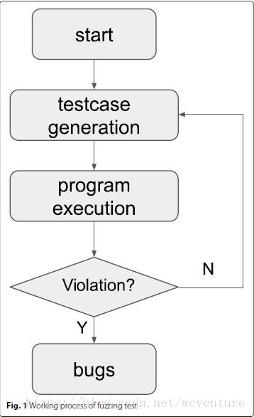
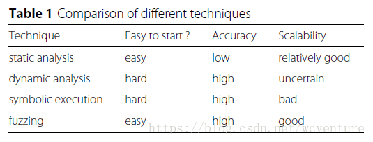
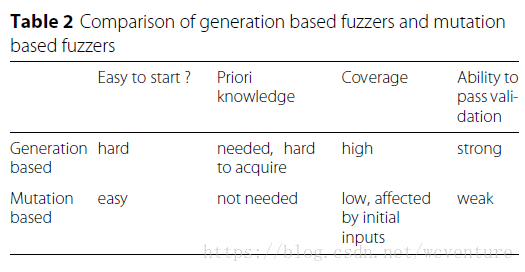
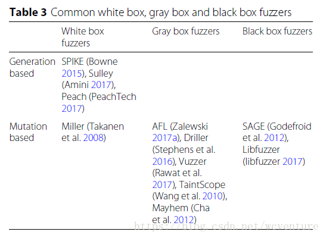
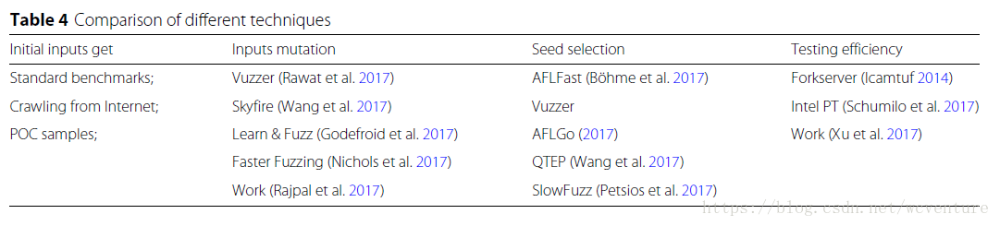
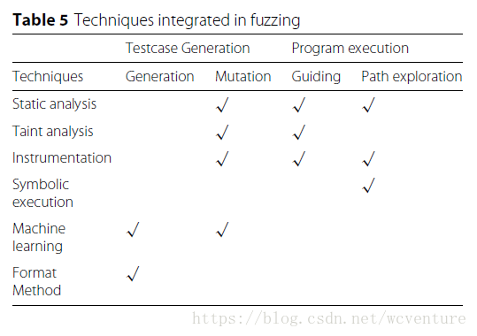
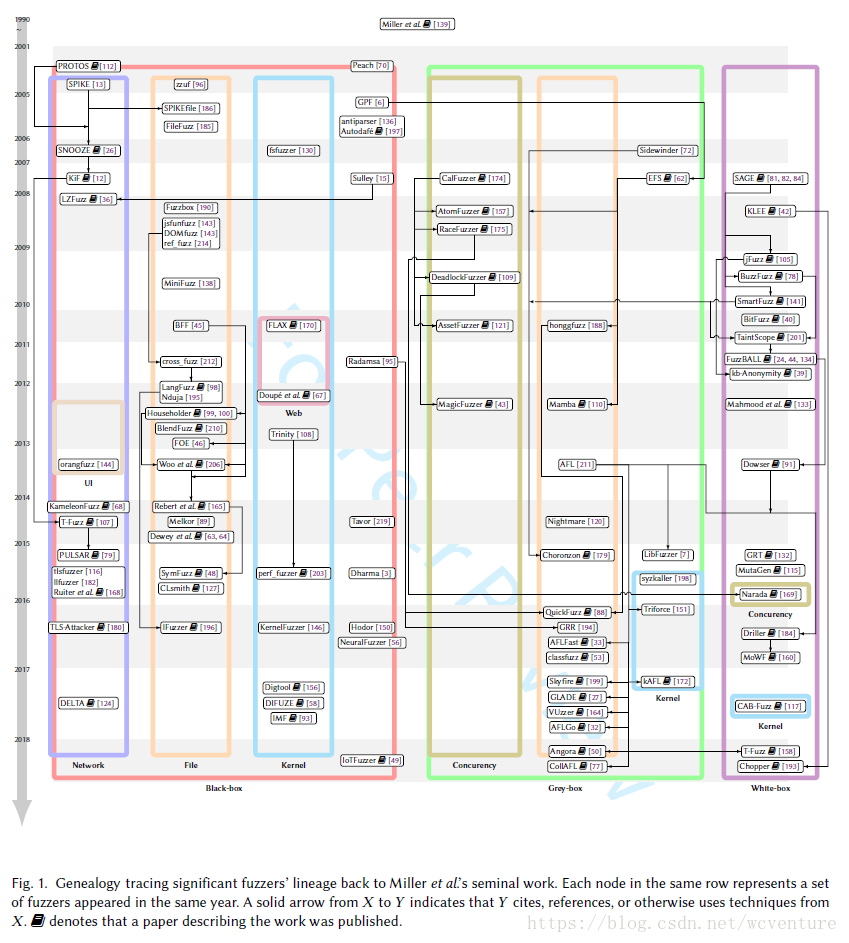
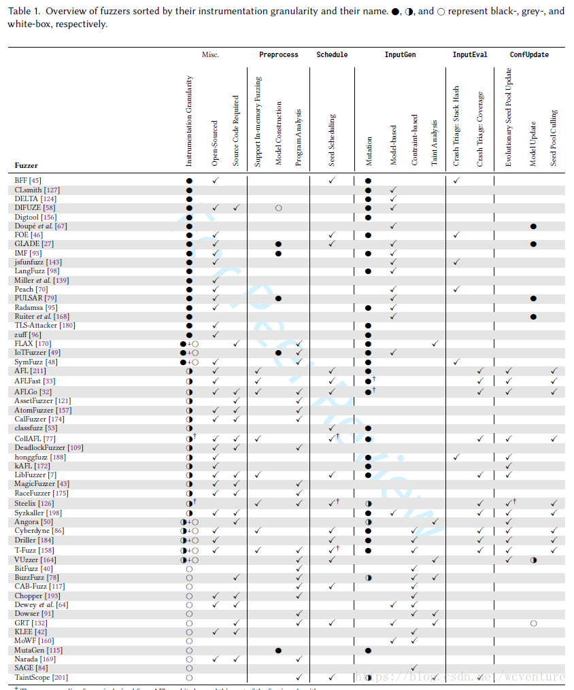

# Fuzzing技术总结与工具列表

版权声明：本文为博主原创文章，未经博主允许不得转载。 https://blog.csdn.net/wcventure/article/details/82085251

首先推荐阅读2018年computing Surveys 的《Fuzzing: Art, Science, and Engineering》
[https://github.com/wcventure/wcventure/blob/master/Paper/Fuzzing_Art_Science_and_Engineering.pdf](https://github.com/wcventure/wcventure/blob/master/Paper/Fuzzing_Art_Science_and_Engineering.pdf)
其次推荐阅读2018年Cybersecurity 的 《Fuzzing: a survey》
[https://www.researchgate.net/publication/325577316_Fuzzing_a_survey](https://www.researchgate.net/publication/325577316_Fuzzing_a_survey)
里面对fuzzing技术和fuzzing工具有详细的介绍。

**一、什么是Fuzzing？**

Fuzz本意是“羽毛、细小的毛发、使模糊、变得模糊”，后来用在软件测试领域，中文一般指“模糊测试”，英文有的叫“Fuzzing”，有的叫“Fuzz Testing”。本文用fuzzing表示模糊测试。

Fuzzing技术可以追溯到1950年，当时计算机的数据主要保存在打孔卡片上，计算机程序读取这些卡片的数据进行计算和输出。如果碰到一些垃圾卡片或一些废弃不适配的卡片，对应的计算机程序就可能产生错误和异常甚至崩溃，这样，Bug就产生了。所以，Fuzzing技术并不是什么新鲜技术，而是随着计算机的产生一起产生的古老的测试技术。

Fuzzing技术是一种基于黑盒（或灰盒）的测试技术，通过自动化生成并执行大量的随机测试用例来发现产品或协议的未知漏洞。随着计算机的发展，Fuzzing技术也在不断发展。

**二、Fuzzing有用么？**

Fuzzing是模糊测试，顾名思义，意味着测试用例是不确定的、模糊的。

计算机是精确的科学和技术，测试技术应该也是一样的，有什么的输入，对应什么样的输出，都应该是明确的，怎么会有模糊不确定的用例呢？这些不确定的测试用例具体会有什么作用呢？

为什么会有不确定的测试用例，我想主要的原因是下面几点：

1、我们无法穷举所有的输入作为测试用例。我们编写测试用例的时候，一般考虑正向测试、反向测试、边界值、超长、超短等一些常见的场景，但我们是没有办法把所有的输入都遍历进行测试的。

2、我们无法想到所有可能的异常场景。由于人类脑力的限制，我们没有办法想到所有可能的异常组合，尤其是现在的软件越来越多的依赖操作系统、中间件、第三方组件，这些系统里的bug或者组合后形成的bug，是我们某个项目组的开发人员、测试人员无法预知的。

3、Fuzzing软件也同样无法遍历所有的异常场景。随着现在软件越来越复杂，可选的输入可以认为有无限个组合，所以即使是使用软件来遍历也是不可能实现的，否则你的版本可能就永远也发布不了。Fuzzing技术本质是依靠随机函数生成随机测试用例来进行测试验证，所以是不确定的。

这些不确定的测试用例会起到我们想要的测试结果么？能发现真正的Bug么？

1、Fuzzing技术首先是一种自动化技术，即软件自动执行相对随机的测试用例。因为是依靠计算机软件自动执行，所以测试效率相对人来讲远远高出几个数量级。比如，一个优秀的测试人员，一天能执行的测试用例数量最多也就是几十个，很难达到100个。而Fuzzing工具可能几分钟就可以轻松执行上百个测试用例。

2、Fuzzing技术本质是依赖随机函数生成随机测试用例，随机性意味着不重复、不可预测，可能有意想不到的输入和结果。

3、根据概率论里面的“大数定律”，只要我们重复的次数够多、随机性够强，那些概率极低的偶然事件就必然会出现。Fuzzing技术就是大数定律的典范应用，足够多的测试用例和随机性，就可以让那些隐藏的很深很难出现的Bug成为必然现象。

目前，Fuzzing技术已经是软件测试、漏洞挖掘领域的最有效的手段之一。Fuzzing技术特别适合用于发现0 Day漏洞，也是众多黑客或黑帽子发现软件漏洞的首选技术。Fuzzing虽然不能直接达到入侵的效果，但是Fuzzing非常容易找到软件或系统的漏洞，以此为突破口深入分析，就更容易找到入侵路径，这就是黑客喜欢Fuzzing技术的原因。

**三、基于生成和基于编译的Fuzzing算法？***

Fuzzing引擎算法中，测试用例的生成方式主要有2种：
1）基于变异：根据已知数据样本通过变异的方法生成新的测试用例；
2）基于生成：根据已知的协议或接口规范进行建模，生成测试用例；
一般Fuzzing工具中，都会综合使用这两种生成方式。

基于变异的算法核心要求是学习已有的数据模型，基于已有数据及对数据的分析，再生成随机数据做为测试用例。

**四、state-of-the-art AFL**

AFL就是著名的基于变异的Fuzzer。
以下有一些关于state-of-the-art AFL的资料

1. american fuzzy lop (2.52b)
    [http://lcamtuf.coredump.cx/afl/](http://lcamtuf.coredump.cx/afl/)
2. AFL内部实现细节小记
    [http://rk700.github.io/2017/12/28/afl-internals/](http://rk700.github.io/2017/12/28/afl-internals/)
3. afl-fuzz技术白皮书
    [https://blog.csdn.net/gengzhikui1992/article/details/50844857](https://blog.csdn.net/gengzhikui1992/article/details/50844857)
4. 如何使用AFL进行一次完整的fuzz过程
    [https://blog.csdn.net/abcdyzhang/article/details/53487683](https://blog.csdn.net/abcdyzhang/article/details/53487683)
5. AFL(American Fuzzy Lop)实现细节与文件变异
    [https://paper.seebug.org/496/](https://paper.seebug.org/496/)
6. fuzz实战之libfuzzer
    [https://www.secpulse.com/archives/71898.html](https://www.secpulse.com/archives/71898.html)



```
- Static analysis
- Dynamic analysis
- Symbolic execution
- Fuzzing
```


```
- Generation-based Fuzzing
- Mutation-based Fuzzing
```




```
- White box fuzzing
- Grey box fuzzing
- Black box fuzzing
```


```
- Fuzzing技术中的关键
```



```
- Fuzzing 中
```



```
- 至今fuzzing工具文献的引用关系，Fuzzing工具的分类和历史
```



```
- Fuzzing 工具之调研，还有一张很好的整理后的图表
```



**最后，再整理一下部分开源fuzzing工具的列表**
原文来自：[[https://www.peerlyst.com/posts/resource-open-source-fuzzers-list]](https://www.peerlyst.com/posts/resource-open-source-fuzzers-list])，并增加2018年最新的诸如CollAFL和SnowFuzz等工具
* 开源Fuzzers工具
* Fuzzing的线束或框架
* 其它 Fuzzers 工具是免费的，但是和开源比不值得一提
* Fuzzing的有效超载
* 博客将帮助你更好的了解Fuzz
* 其它关于Fuzzing博客或资源
* 商业Fuzzers工具

**一、开源Fuzzers**

1. CollAFL  
[http://chao.100871.net/papers/oakland18.pdf](http://chao.100871.net/papers/oakland18.pdf)  
路径敏感的Fuzzer，解决了AFL中bitmap路径冲突的问题。并提出了一种选择seed的策略，能更快提高覆盖率。

2. SnowFuzz  
[https://arxiv.org/pdf/1708.08437.pdf](https://arxiv.org/pdf/1708.08437.pdf)

3. VUzzer
[http://www.cs.vu.nl//~giuffrida/papers/vuzzer-ndss-2017.pdf](http://www.cs.vu.nl//~giuffrida/papers/vuzzer-ndss-2017.pdf)  
基于应用感知的自进化模糊工具。在这篇文章中，我们提出一个应用感知的进化模糊策略（不需要以前的知识应用或格式输入）。为了最小化地覆盖并扩展更深的路径，我们利用基于静态和动态分析的控制以及数据流功能，来推断应用程序的基本属性。与Application-agnostic方法相比，这可以更快地生成有趣的输入。我们实行我们的模糊策略在VUzzer上，并且用三种不同的数据评估它：DARPA的大挑战二进制文件（CGC）、一组真实的应用程序（二进制输入解析器）和最近发布的LAVA数据集。

4. Afl-fuzz（American fuzzy lop）
[http://lcamtuf.coredump.cx/afl/](http://lcamtuf.coredump.cx/afl/)  
Afl-fuzz是一种基于面向安全的模糊测试工具，它采用了一种新型的方式（编译时检测和遗传算法），来自动发掘干净的、有趣的测试案例，即在目标二进制中触发新的内部状态。这基本上改善了模糊代码的功能覆盖。该工具生成的简洁的合成语料库也可以用来传播其它更多的劳动型或资源密集型测试方案。
与其他仪器化的模糊工具相比，afl-fuzz是以实用性而被设计的：它具有适度的性能开销，采用了多种高效的模糊战略，和努力最小化的技巧，基本上不需要配置，并且能够无缝处理复杂的、真实世界案例，以及常见的图像分析或文件压缩等。

5. Filebuster  
一个非常快速和灵活的网络模糊工具

6. TriforceAFL
AFL / QEMU 模糊器具有全系统的仿真。这是AFL的修补版本，支持使用QEMU的全系统模糊测试。它所包含的QEMU已经更新，允许在运行x86_64的系统仿真器时进行分支机构跟踪。它也添加了额外的指令来启动AFL的forkserver，进行模糊设置，并标记测试用例的启动和停止。

7. Nightmare:
[https://github.com/joxeankoret/nightmare](https://github.com/joxeankoret/nightmare)  
一个具有web管理的分布式模糊测试套件。

8. Grr  
DECREE二进制的高吞吐量模糊器和仿真器

9. Randy:
[http://ptrace-security.com/blog/randy-random-based-fuzzer-in-python/](http://ptrace-security.com/blog/randy-random-based-fuzzer-in-python/)  
Python中的基于随机的模糊工具

10. IFuzzer
一个进化型的翻译模糊器

11. Dizzy:
[https://github.com/ernw/dizzy](https://github.com/ernw/dizzy)  
基于python的模糊框架：
(1) 可以发送到L2以及上层（TCP / UDP / SCTP）  
(2)能够处理奇长度分组字段（无需匹配字节边界，因此即使单个标志或7位长字也可以表示和模糊）
(3) 非常容易的协议定义语法
(4) 能够做多包状态的完全模糊，能够使用接收到的目标数据作为响应

12. Address Sanitizer:
[https://github.com/Google/sanitizers](https://github.com/Google/sanitizers)
地址Sanitizer、线Sanitizer、记忆Sanitizer

13. Diffy:
[https://github.com/twitter/diffy](https://github.com/twitter/diffy)
使用Diffy查找您的服务中的潜在错误

14. Wfuzz:
[https://github.com/xmendez/wfuzz](https://github.com/xmendez/wfuzz)
Web应用程序[HTTP://www.edge-security.com/wfuzz.php](http://www.edge-security.com/wfuzz.php)

15. Go-fuzz:
[https://github.com/Google/gofuzz](https://github.com/Google/gofuzz)
基于放弃的模糊测试

16. Sulley:
[https://github.com/OpenRCE/sulley](https://github.com/OpenRCE/sulley)
Sulley是一个积极开发的模糊引擎和模糊测试框架，由多个可扩展组件组成。Sulley（IMHO）超过了此前公布的大所属模糊技术、商业和公共领域的能力。框架的目标是不仅是可以简化数据表示，而且也可以简化数据传输和仪表。Sulley是以 Monsters Inc.的生物来命名的，因为，他是模糊的。写在python内的。

17. Sulley_l2:
[http://ernw.de/download/sulley_l2.tar.bz2](http://ernw.de/download/sulley_l2.tar.bz2)
有些人可能记得2008年发布的sulley_l2，它是sulley模糊框架的修改版本，增强了第2层发送功能和一堆（L2）模糊脚本。所有的blinking, rebooting, mem-corrupting引起了我们的一些关注。从那以后，我们继续写和使用这些模糊脚本，所以它的洞集合增长了。

18. CERT Basic Fuzzing Framework (BFF)For linux, OSX
[https://github.com/CERTCC-Vulnerability-Analysis/certfuzz](https://github.com/CERTCC-Vulnerability-Analysis/certfuzz)
[http://www.cert.org/vulnerability-analysis/tools/bff.cfm](http://www.cert.org/vulnerability-analysis/tools/bff.cfm)
cert基本模糊框架（BFF）是一个软件测试工具，它用于在linux和mac os x平台上运行的应用程序中寻找漏洞。BFF对消耗文件输入的软件执行突变性的模糊测试。（突变性模糊测试是采取形式良好的输入数据并以各种方式破坏它的行为，寻找导致崩溃的情况。）BFF自动收集导致了软件以独特方式使测试用例崩溃，以及利用崩溃来调试信息。BFF的目标是去最小化软件供应商和安全研究人员通过模糊测试有效地发现和分析发现的安全漏洞过程中所需要的努力。

19. CERT Failure Observation Engine (FOE)For windows
[http://www.cert.org/vulnerability-analysis/tools/foe.cfmhttps://github.com/CERTCC-Vulnerability-Analysis/certfuzz](http://www.cert.org/vulnerability-analysis/tools/foe.cfmhttps://github.com/CERTCC-Vulnerability-Analysis/certfuzz)
The cert Failure Observation Engine (FOE) 是一个软件测试工具，它被用于在Windows平台上运行的应用程序中发现漏洞。FOE在消耗文件输入的软件上执行突变模糊测试。（突变性模糊测试是采取形式良好的输入数据并以各种方式破坏它的行为，寻找导致崩溃的情况。）FOE自动收集导致了软件以独特方式使测试用例崩溃，以及利用崩溃来调试信息。FOE的目标是去最小化软件供应商和安全研究人员通过模糊测试有效地发现和分析发现的安全漏洞过程中所需要的努力。

20. DranzerFor ActiveX Controls.
[https://github.com/CERTCC-Vulnerability-Analysis/dranzer](https://github.com/CERTCC-Vulnerability-Analysis/dranzer)
Dranzer是一个工具，使用户能够检查有效的技术，它用于模糊测试ActiveX控件

21. Radamsaa general purpose fuzzer
[https://github.com/aoh/radamsa](https://github.com/aoh/radamsa)
Radamsa是一个用于鲁棒性测试的测试用例生成器，也称为fuzzer。它可以用来测试一个程序是否可以承受格式错误以及潜在的恶意输入。它通过制造文件来工作（有趣的不同于通常给定的文件），然后将修改的文件提供给Target程序，或者这样或通过一些脚本。radamsa的主要卖点（而不是其他的模糊器）是：它是非常容易在大多数机器上运行，而且很容易从命令行脚本，这已经被用来找到程序中的一系列安全问题，而且你可能现在正在使用。

22. zzufApplication fuzzer
[https://github.com/samhocevar/zzuf](https://github.com/samhocevar/zzuf)
zzuf是一个透明的应用程序输入模糊器。 它的工作原理是截取文件操作并更改程序输入中的随机位。zzuf的行为是确定性的，使得它很容易再现错误。 有关如何使用zzuf的说明和示例，请参阅手册页和网站[http://caca.zoy.org/wiki/zzuf](http://caca.zoy.org/wiki/zzuf)

23. Backfuzz
[https://github.com/localh0t/backfuzz](https://github.com/localh0t/backfuzz)
Backfuzz是一个用python写成的有着不同协议（FTP，HTTP，IMAP等）的模糊工具。因为一般的想法是这个脚本有几个预定义的功能，所以谁想要编写自己的插件（为另一个协议）就可以在一些行这样做。

24. KEMUfuzzer
[https://github.com/jrmuizel/kemufuzzer](https://github.com/jrmuizel/kemufuzzer)
KEmuFuzzer是一个基于仿真或直接本地执行测试系统虚拟机的工具。 目前KEmuFuzzer支持：BHOCS，QEMU，VMware和virtualbox。

25. Pathgrind
[https://github.com/codelion/pathgrind](https://github.com/codelion/pathgrind)
Pathgrind使用基于路径的动态分析来fuzz linux / unix二进制。 它是基于valgrind被写在python内的。

26. Wadi-fuzzer
[https://www.sensepost.com/blog/2015/wadi-fuzzer/](https://www.sensepost.com/blog/2015/wadi-fuzzer/) [https://gitlab.sensepost.com/saif/DOM-Fuzzer](https://gitlab.sensepost.com/saif/DOM-Fuzzer)
Wadi是基于web浏览器语法的模糊器。 这个语法用于描述浏览器应该如何处理Web内容，Wadi转向并使用语法来打破浏览器。
Wadi是一个Fuzzing模块，用于NodeFuzz fuzzing Harness并利用AddressSanitizer（ASan）在Linux和Mac OSX上进行测试。
万维网联盟（W3C）是一个国际组织，它开发开放标准以确保Web的长期增长。 W3C允许我们搜索语法并在我们的测试用例中使用。

27. LibFuzzer, Clang-format-fuzzer, clang-fuzzer
[http://llvm.org/docs/LibFuzzer.html](http://llvm.org/docs/LibFuzzer.html)
[http://llvm.org/viewvc/llvm-project/cfe/trunk/tools/clang-format/fuzzer/ClangFormatFuzzer.cpp?view=markup](http://llvm.org/viewvc/llvm-project/cfe/trunk/tools/clang-format/fuzzer/ClangFormatFuzzer.cpp?view=markup)
[http://llvm.org/viewvc/llvm-project/cfe/trunk/tools/clang-fuzzer/ClangFuzzer.cpp?view=markup](http://llvm.org/viewvc/llvm-project/cfe/trunk/tools/clang-fuzzer/ClangFuzzer.cpp?view=markup)
我们在LibFuzzer上实现了两个模糊器：clang-format-fuzzer和clang-fuzzer。Clang格式大多是一个词法分析器，所以给它随机字节格式是会完美运行的，但也伴随着超过20个错误。然而Clang不仅仅是一个词法分析器，给它随机字节时几乎没有划伤其表面，所以除了测试随机字节，我们还在令牌感知模式中模糊了Clang。两种模式中都发现了错误; 其中一些以前被AFL检测到，另一些则不是：我们使用AddressSanitizer运行这个模糊器，结果发现一些错误在没有它的情况下不容易被发现。

28. Perf-fuzzer
[http://www.eece.maine.edu/~vweaver/projects/perf_events/validation/https://github.com/deater/perf_event_testshttp://web.eece.maine.edu/~vweaver/projects/perf_events/fuzzer/](http://www.eece.maine.edu/~vweaver/projects/perf_events/validation/https://github.com/deater/perf_event_testshttp://web.eece.maine.edu/~vweaver/projects/perf_events/fuzzer/)
用于Linux perf_event子系统的测试套件

29. HTTP/2 Fuzzer
[https://github.com/c0nrad/http2fuzz](https://github.com/c0nrad/http2fuzz)
HTTP2模糊器内置于Golang。

30. QuickFuzz
[http://quickfuzz.org/](http://quickfuzz.org/)
QuickFuzz是一个语法模糊器，由QuickCheck，模板Haskell和Hackage的特定库生成许多复杂的文件格式，如Jpeg，Png，Svg，Xml，Zip，Tar和更多！ QuickFuzz是开源的（GPL3），它可以使用其他错误检测工具，如zzuf，radamsa，honggfuzz和valgrind。

31. SymFuzz
[https://github.com/maurer/symfuzz](https://github.com/maurer/symfuzz)
[http://ieeexplore.IEEE.org/xpls/abs_all.jsp?arnumber=7163057](http://ieeexplore.ieee.org/xpls/abs_all.jsp?arnumber=7163057)
摘要？我们提出了一个算法的设计，以最大化数量的bug为黑盒子突变性的模糊给定一个程序和种子的输入。主要的直观性的是利用给定程序 - 种子对的执行轨迹上的白盒符号进行分析，来检测输入的BIT位置之间的依赖性，然后使用这种依赖关系来为该程序种子对计算概率上最佳的突变比率。我们的结果是有希望的：我们发现使用相同的模糊时间，这比8个应用程序中的三个以前的模糊器的平均错误多38.6％。

32. OFuzz
[https://github.com/sangkilc/ofuzz](https://github.com/sangkilc/ofuzz)
OFuzz是一个用OCaml编写的模糊平台。 OFuzz目前专注于在* nix平台上运行的文件处理应用程序。 OFuzz的主要设计原则是灵活性：必须容易添加/替换模糊组件（崩溃分类模块，测试用例生成器等）或算法（突变算法，调度算法）。

33. Bed
[http://www.snake-basket.de/](http://www.snake-basket.de/)
网络协议fuzzer。 BED是一个程序，旨在检查守护程序的潜在缓冲区溢出、格式字符串等。

34. Neural Fuzzer
[https://cifasis.github.io/neural-fuzzer/](https://cifasis.github.io/neural-fuzzer/)
神经模糊测试工具是一种实验性模糊器，它被设计使用国家最先进的机器，从一组初始文件学习。 它分为两个阶段：训练和生成。

35. Pulsar
[https://github.com/hgascon/pulsar](https://github.com/hgascon/pulsar)
协议学习，模拟和状态模糊器
Pulsar是一个具有自动协议学习和模拟能力的网络模糊器。该工具允许通过机器学习技术来建模协议，例如聚类和隐马尔可夫模型。这些模型可以用于模拟Pulsar与真实客户端或服务器之间进行通信，这些消息，在一系列模糊原语的结合下，让测试一个未知协议错误的实施在更深的状态协议。

36. D-bus fuzzer:
[https://github.com/matusmarhefka/dfuzzer](https://github.com/matusmarhefka/dfuzzer)
dfuzzer是D-Bus模糊器，是用于通过D-Bus进行通信的模糊测试过程的工具。它可以用于测试连接到会话总线和系统总线守护程序的进程。模糊器为客户端工作，它首先连接到总线守护进程，然后它遍历并模糊测试由D-Bus服务提供的所有方法。

37. Choronzon
[https://census-labs.com/news/2016/07/20/choronzon-public-release/](https://census-labs.com/news/2016/07/20/choronzon-public-release/)
Choronzon是一个进化型的模糊工具。它试图模仿进化过程，以保持产生更好的结果。 为了实现这一点，它具有评估系统的能力，用以分类哪些模糊文件是有趣的，哪些应该被丢弃。
此外，Choronzon是一个基于知识的模糊器。 它使用用户定义的信息来读取和写入目标文件格式的文件。要熟悉Choronzon的术语，您应该考虑每个文件由染色体表示。用户应该描述所考虑的文件格式的基本结构， 优选文件格式的高级概述，而不是描述它的每个细节和方面。那些用户定义的基本结构中的每一个都被认为是基因， 每个染色体包含一个基因树，并且它能够从中构建相应的文件。

38. Exploitable
  
    
‘exploitable’是一个GDB扩展，它会按严重性分类Linux应用程序错误。扩展检查已崩溃的Linux应用程序的状态，并输出攻击者利用底层软件错误获得系统控制有多困难的总结。扩展可以用于为软件开发人员确定bug的优先级，以便他们可以首先解决最严重的bug。
该扩展实现了一个名为“exploitable”的GDB命令。 该命令使用启发式来描述当前在GDB中调试的应用程序的状态的可利用性。 该命令旨在用于包含GDB Python API的Linux平台和GDB版本。 请注意，此时命令将无法在核心文件目标上正确运行。

39. Hodor
  
    
我们想设计一个通用的模糊器，可以用来配置使用已知的良好的输入和分隔符，以模糊特定的位置。在一个完全愚钝的模糊器和一些更聪明的东西之间，与实现适当的智能模糊器相比，表现着更少的努力。

40. BrundleFuzz
[https://github.com/carlosgprado/BrundleFuzz](https://github.com/carlosgprado/BrundleFuzz)
BrundleFuzz是一个用于Windows和Linux的分布式模糊器，使用动态二进制仪器。

41. Netzob
[https://www.netzob.org/](https://www.netzob.org/)
用于通信协议的逆向工程、流量生成和模糊化的开源工具

42. PassiveFuzzFrameworkOSX
该框架用于在内核模式下基于被动内联挂钩机制来模糊OSX内核漏洞。

43. syntribos
OpenStack安全组的Python API安全测试工具

44. honggfuzz
[http://google.github.io/honggfuzz/](http://google.github.io/honggfuzz/)
一个通用的，易于使用的有趣的分析选项的模糊器。 支持基于代码覆盖率的反馈驱动的模糊测试

45. dotdotpwn
[http://dotdotpwn.blogspot.com/](http://dotdotpwn.blogspot.com/)
目录遍历模糊工具

46. KernelFuzzer
跨平台内核Fuzzer框架。DEF CON 24视频：
[https://www.youtube.com/watch?v=M8ThCIfVXow](https://www.youtube.com/watch?v=M8ThCIfVXow)

47. PyJFuzz
PyJFuzz - Python JSON Fuzzer
PyJFuzz是一个小的、可扩展的和现成可用的框架，用于模糊JSON输入，如移动端点REST API，JSON实现，浏览器，cli可执行和更多。

48. RamFuzz
单个方法参数的模糊器。

49. EMFFuzzer
基于桃树模糊框架的增强的元文件模糊器

50. js-fuzz
一个基于javascript的AFL启发的遗传模糊测试器。

51. syzkaller
syzkaller是一个无监督的、覆盖引导的Linux系统调用模糊器。

**二、模糊线束/框架使fuzzer提高：**

1. FuzzFlow
Fuzzflow是来自cisco talos的一个分布式的模糊管理框架，它提供虚拟机管理，模糊作业配、可插拔变异引擎、前/后变形脚本、崩溃收集和可插拔崩溃分析。

2. fuzzinator
Fuzzinator是一个模糊测试框架，可以帮助你自动化任务，它通常需要在一个fuzz会话：
运行您最喜欢的测试生成器并将测试用例馈送到测试中的系统，
抓住和保存独特的问题，
减少失败的测试用例，
缓解错误跟踪器中的问题报告（例如，Bugzilla或GitHub），
如果需要，定期更新SUT
计划多个SUT和发电机，而不会使工作站超载。

3. Fuzzlabs
[https://github.com/DCNWS/FuzzLabs](https://github.com/DCNWS/FuzzLabs)
FuzzLabs在一个模块化的模糊框架中，用Python编写。 它使用了令人惊叹的Sulley模糊框架的修改版本作为核心引擎。 FuzzLabs仍在开发中。

4. Nodefuzz
[https://github.com/attekett/NodeFuzz](https://github.com/attekett/NodeFuzz)
对于Linux和Mac OSX。 NodeFuzz是一个用于网络浏览器和类似浏览器的应用程序的模糊器。 NodeFuzz背后有两个主要的想法：第一是创建一个简单、快速、不同浏览器的fuzz方法。 第二，有一个线束，可以轻松地扩展与新的测试用例发生器和客户端仪器，无需修改核心。

5. Grinder
[https://github.com/stephenfewer/grinder](https://github.com/stephenfewer/grinder)
对于windows Grinder是一个自动化浏览器的模糊化和大量崩溃管理的系统。

6. Kitty
[https://github.com/Cisco-sas/kitty](https://github.com/Cisco-sas/kitty)
Kitty是一个开源的模块化和可扩展的模糊框架，使用python编写，灵感来自OpenRCE的Sulley和Michael Eddington（现在是Deja vu Security的）Peach Fuzzer。

7. Peach
[http://community.peachfuzzer.com/](http://community.peachfuzzer.com/)
[https://github.com/MozillaSecurity/peach](https://github.com/MozillaSecurity/peach)
Peach是一个SmartFuzzer，能够执行基于生成和基于突变的模糊测试。

**三、此外，还有这些免费的但不是开源的fuzzer：**

1. SDL MiniFuzz File Fuzzer
[https://www.Microsoft.com/en-us/download/details.aspx?id=21769](https://www.microsoft.com/en-us/download/details.aspx?id=21769)
对于Windows。 SDL MiniFuzz File Fuzzer是一个基本的文件模糊工具，旨在简化非安全开发人员对模糊测试的采用，这些非安全开发人员不熟悉文件模糊工具或从未在当前的软件开发过程中使用它们。

2. Rfuzz
[http://rfuzz.rubyforge.org/index.html](http://rfuzz.rubyforge.org/index.html)
RFuzz是一个Ruby库，可以使用快速HttpClient和wicked vil RandomGenerator轻松地从外部测试Web应用程序，它允许普通程序员每天使用先进的模糊技术。

3. Spike
[http://www.immunitysec.com/downloads/SPIKE2.9.tgz](http://www.immunitysec.com/downloads/SPIKE2.9.tgz)
SPIKE是一个API框架，允许你编写模糊器。

4. Regex Fuzzer
[http://go.microsoft.com/?linkid=9751929](http://go.microsoft.com/?linkid=9751929)
DL Regex Fuzzer是一个验证工具，用于帮助测试正则表达式是否存在潜在的拒绝服务漏洞。它包含用指数时间执行的某些子句的正则表达式模式（例如，包含自身重复的重复的子句）可以被攻击者利用来引起拒绝服务（DoS）条件。SDL Regex Fuzzer与SDL过程模板和MSF-Agile + SDL过程模板集成，以帮助用户跟踪和消除其项目中的任何检测到的正则表达式漏洞。

**四、博客，将帮助你fuzz更好**
1. Yawml的开始到完成模糊与AFL（一个完整的fuzzjob由foxglovesecurity）
[http://foxglovesecurity.com/2016/03/15/fuzzing-workflows-a-fuzz-job-from-start-to-finish/](http://foxglovesecurity.com/2016/03/15/fuzzing-workflows-a-fuzz-job-from-start-to-finish/)

2. Fuzz更聪明，更难 - 用afl引发模糊，来自bsidessf2016的引物
[https://www.peerlyst.com/posts/bsidessf-2016-recap-of-fuzz-smarter-not-harder-an-afl-primer-claus-cramon](https://www.peerlyst.com/posts/bsidessf-2016-recap-of-fuzz-smarter-not-harder-an-afl-primer-claus-cramon)

3. Fuzzing和afl是一种艺术
Fuzzing nginx 和 American Fuzzy Lop
您可以在此处的评论或此Google文档中发表建议：
[https://docs.google.com/document/d/17pZxfs8hXBCnhfHoKfJ7JteGziNB2V_VshsVxmNRx6U/edit?usp=sharing](https://docs.google.com/document/d/17pZxfs8hXBCnhfHoKfJ7JteGziNB2V_VshsVxmNRx6U/edit?usp=sharing)

4. BSidesLisbon 2016主题演讲：智能模糊器革命
Windows内核模糊初学者 - Ben Nagy

**五、其他Fuzzer博客：**
循环使用编译器转换的模糊包版
谷歌推出了OSS-Fuzz（感谢Dinko Cherkezov） - 一个项目，旨在不断开发开源项目fuzz：
OSS-Fuzz现在正在测试中，并即将接受候选开源项目的建议。为了使项目被OSS-Fuzz接受，它需要有一个庞大的用户基础或针对于至关重要的全球IT基础设施，这是一个通用启发式方法，我们有意在这个早期阶段解释。查看更多详情和说明如何在这里申请。
一旦项目注册了OSS-Fuzz，它将自动接收到我们的跟踪器中，新报告的错误披露截止于90天后（见此处的详细信息）。 这符合行业的最佳实践，并通过更快地为用户提供补丁来提高最终用户的安全性和稳定性。
帮助我们确保这个程序真正服务于开源社区和依赖这个关键软件的互联网，贡献和留下您的反馈在GitHub。


**六、商业模糊器**

超越安全的暴风雨
[http://www.beyondsecurity.com/bestorm_and_the_SDL.html](http://www.beyondsecurity.com/bestorm_and_the_SDL.html)
管理员编辑：查找更多真棒Peerlyst社区贡献的资源，资源目录在这里。  

  
**七、关于浏览器的Fuzzing**

1. Skyfire 一种用于Fuzzing的数据驱动的种子生成工具
[https://www.inforsec.org/wp/?p=2678](https://www.inforsec.org/wp/?p=2678)
[https://www.ieee-security.org/TC/SP2017/papers/42.pdf](https://www.ieee-security.org/TC/SP2017/papers/42.pdf)

2. 使用libFuzzer fuzz Chrome V8入门指南
[http://www.4hou.com/info/news/6191.html](http://www.4hou.com/info/news/6191.html)


