## Windows自动化脚本提权

* October 06, 2018
* • [SoftNight](https://paper.tuisec.win/search.jsp?keywords=SoftNight&&search_by_html=author)

原文：
[http://www.hackingarticles.in/window-privilege-escalation-via-automated-script/](http://www.hackingarticles.in/window-privilege-escalation-via-automated-script/)

大家都知道，当我们入侵了一台服务器并拿到了低权限shell时需要进行提权。
本文就来讲解如何提权并判断哪些低权限的shell可以提升到高级权限。

**目录**
介绍
提权向量
windows-Exploit-Suggester
Windows Gather Applied Patches
sherlock
JAWS—另一种Windows遍历脚本
PowerUp

**介绍**
提权一般是在攻击者已经成功入侵受害者的主机后的一个过程，在这个过程中，攻击者要尝试收集关于系统的更多关键信息，比如隐藏的密码和某些配置不当的服务与应用等。所有这些信息都会帮助攻击者对受害主机进行后渗透以便拿到高权限的shell。

**提权向量**
下面这些信息是Windows系统中的关键信息：
操作系统版本
已安装或正在运行的存在漏洞的安装包
具有完全控制或修改权限的文件和文件夹
映射驱动器
引人注意的异常文件
不带引号的服务路径
网络信息(接口,arp,netstat等)
防火墙状态和规则
运行进程
AlwaysInstallElevated注册表项检查
存储的凭证
DLL劫持
计划任务

在渗透测试过程中，有一些脚本能够帮你快速识别Windows系统中的提权向量，本文我们就来一一详细讲解。

**Windows-Exploit-suggester**
如果你已经获得了受害主机的低权限meterpreter会话或者命令会话，那么你就可以使用这个脚本。
这个脚本会告诉你本地可用的exp。这些给出的exp是根据受害主机的操作系统平台和架构，还有根据本地可用的exp来选择的。需要注意的是，并不是所有的exp都可以有效利用。需要根据下列条件来选择exp：会话类型，平台，架构还有所需的默认选项等。
使用该脚本非常简单，输入下列命令即可：

use post/multi/recon/local_exploit_suggester
msf post(local_exploit_suggester) > set lhost 192.168.1.107
msf post(local_exploit_suggester) > set session 1
msf post(local_exploit_suggester) > exploit 

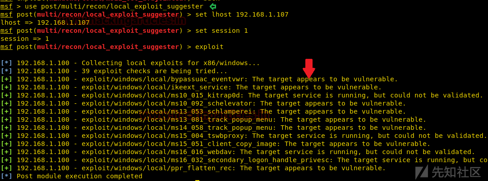从图片中可以看到，脚本已经检测出了哪些exp可以利用并且能够进行提权。

**Windows Gather Applied Patches**
这个模块会根据WMI查询的结果来遍历Windows系统中安装的补丁，WMI查询语句如下：

SELECT HotFixID FROM Win32_QuickFixEngineering 

脚本用法：

use post/windows/gather/enum_patches
msf post(enum_patches) > set session 1
msf post(enum_patches) > exploit 

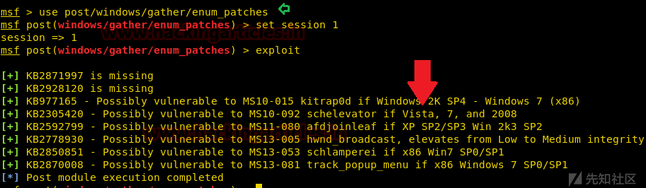如图所示，该脚本已经根据补丁显示了受害主机存在哪些漏洞和对应的能够提权的exp。

**sherlock**
这是一个Powershell脚本，能够快速找到缺失的软件补丁并进行本地提权。这个脚本跟上面的脚本类似，能够找到受害主机存在哪些漏洞和对应的可以提权的exp。

使用下面的命令从GitHub上下载脚本，当你获取一个受害主机的meterpreter会话时执行脚本，如下所示：

git clone https://github.com/rasta-mouse/Sherlock.git 

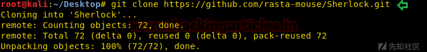由于这个脚本是在powershell中执行的，所以需要先加载powershell，然后再导入这个下载的脚本：

load powershell 

powershell_import '/root/Desktop/Sherlock/Sherlock.ps1'
powershell_execute “find-allvulns” 

上面的命令会输出目标靶机存在的漏洞和可以用来提权的exp，如图：
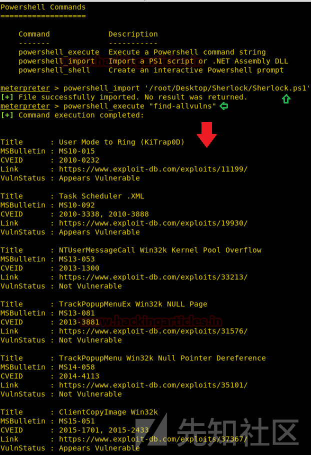

**JAWS—另一个Windows遍历脚本**
JAWS也是一个powershell脚本，目的是为了帮助渗透测试员和CTF选手快速识别Windows主机上的提权向量。该脚本是用powershell2.0编写的，所以在win7之后的主机上都可以运行。
当前功能
网络信息收集(接口,arp,netstat)
防火墙状态和规则
运行的进程
具有完全控制权限的文件和文件夹
映射驱动器
引人注意的异常文件
不带引号的服务路径
近期使用的文档
系统安装文件
AlwaysInstallElevted注册表项检查
存储的凭证
安装的应用
潜在的漏洞服务
MuiCache文件
计划任务

使用下面的命令下载脚本：

git clone https://github.com/411Hall/JAWS.git 

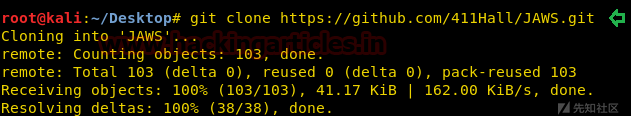一旦你获得了meterpreter会话，上传这个脚本然后在命令行中执行：

powershell.exe -ExecutionPolicy Bypass -File .\jaws-enum.ps1 -OutputFilename JAWS-Enum.txt 

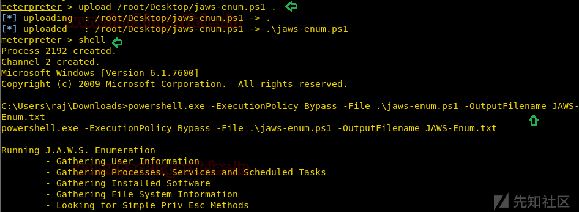它会将关键信息保存在JAWS-Enum.txt文件中。
前面说到过，JAWS-Enum.txt这个文件存储着能够进行提权的向量，现在我们打开这个文件来看看结果。
下图中显示了所有的用户名和IP配置信息。
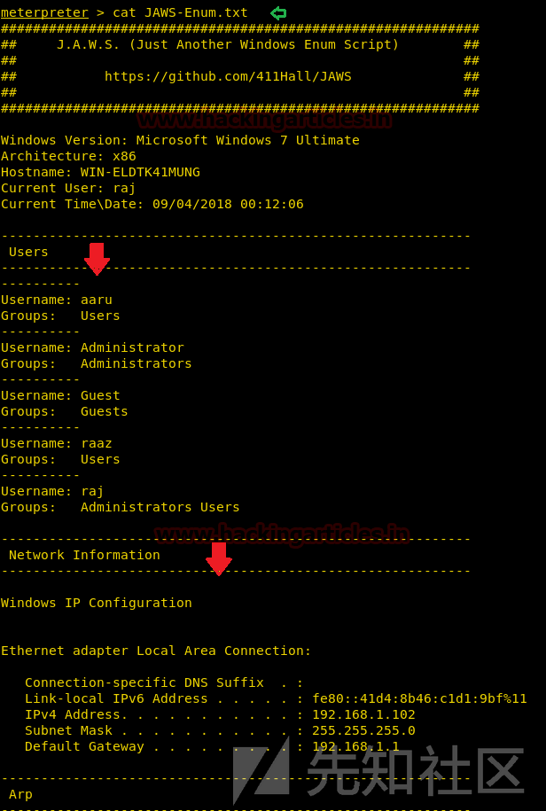

也可以清楚的看到netstat的结果，如图：
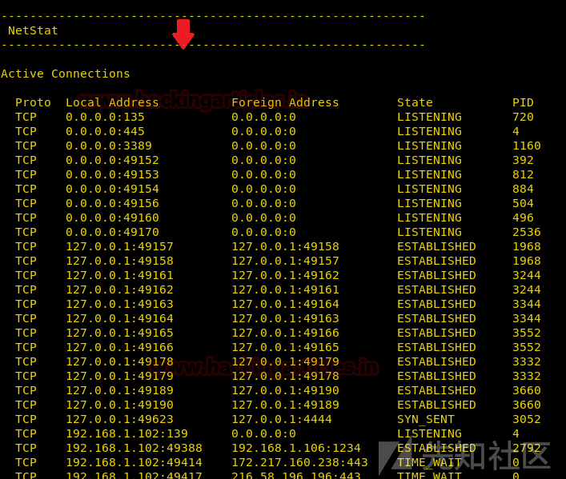

正在运行的进程和服务
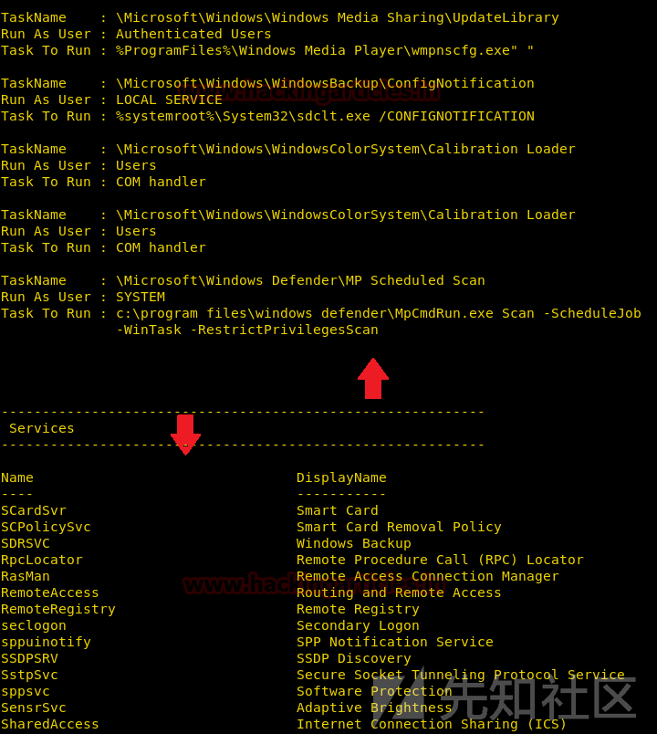

所有安装的程序和补丁
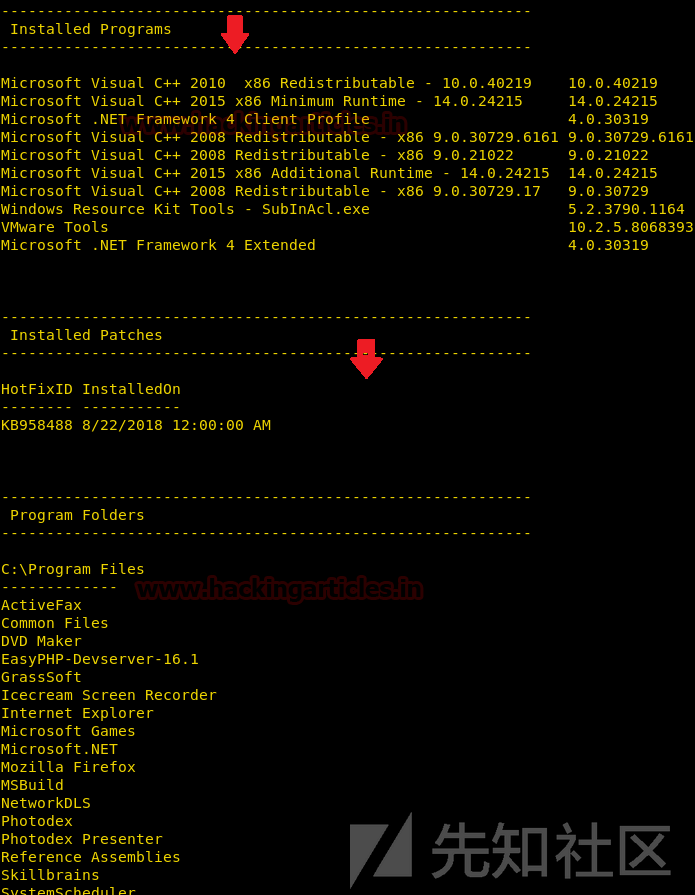

还可以看到具有完全控制和修改权限的文件夹
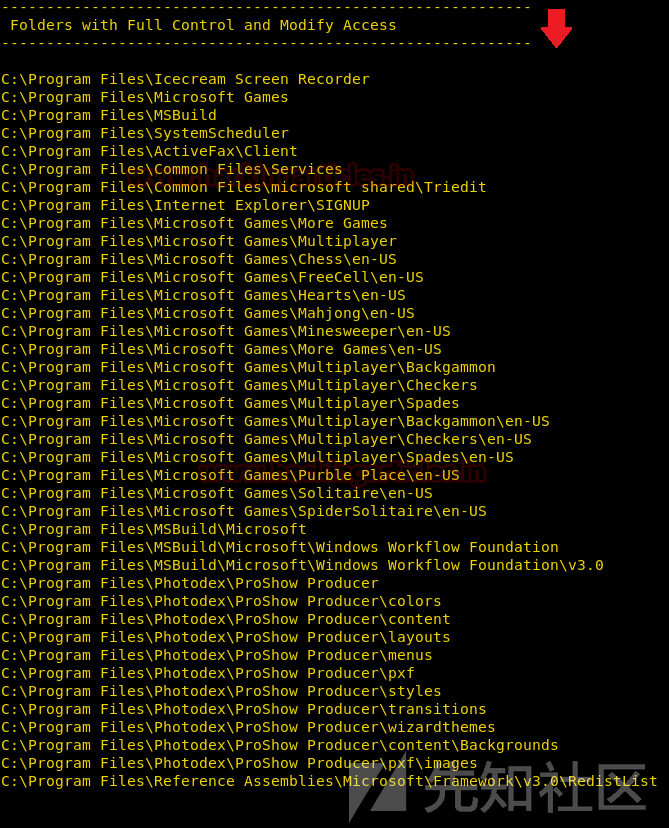

当然，运行这个脚本还能提取到更多的关键信息，大家可以自己摸索一下。

**PowerUp**
PowerUp是一个powershell工具，能够协助在Windows系统上进行本地权限提升。PowerUp的目的是整合所有因为配置错误而导致的Windows本地权限提权向量。

运行Invoke-Allchecks会输出所有可识别的漏洞。
当前功能
服务遍历
Get-ServiceUnquoted--返回名字中有空格且未加引号的服务路径
Get-ModifiableServiceFile—返回当前用户可以向服务二进制路径和配置文件写入的服务
Get-ModifiableService—返回当前用户可以修改的服务
Get-ServiceDetail—返回指定服务的详细信息

服务滥用
Invoke-ServiceAbuse—修改存在漏洞的服务，创建本地管理员或执行自定义的命令
Write-ServiceBinary—编写经过修改的C#服务二进制文件来添加本地管理员或执行自定义命令
Install-ServiceBinary—替换服务二进制文件来添加本地管理员或执行自定义命令
Restore-ServiceBinary—使用原始可执行文件恢复已经替换的服务二进制文件

DLL劫持
Find-ProcessDLLHijack—发现当前正在运行的进程是否存在DLL劫持
Find-PathDLLHijack—查找环境变量“%PATH%是否存在DLL劫持”
Write-HijackDll—编写可劫持的DLL

注册表检查
Get-RegistryAlwaysInstallElevated—检查是否设置了AlwaysInstallElevated注册表项
Get-RegistryAutoLogon—检查注册表中是否有AutoLogon凭证
Get-ModifiableRegistryAutoRun—在HKLM autoruns中检查任何可修改的二进制文件/脚本或配置文件

前面提到过，PowerUp是powersploit的一个模块，所以我们需要下载powersploit，使用下面的命令从GitHub上下载：

git clone https://github.com/PowerShellMafia/PowerSploit.git 

然后切换到Powersploit目录下，可以看到powerup脚本

cd PowerSploit
ls
cd Privesc
ls 

如图所示：
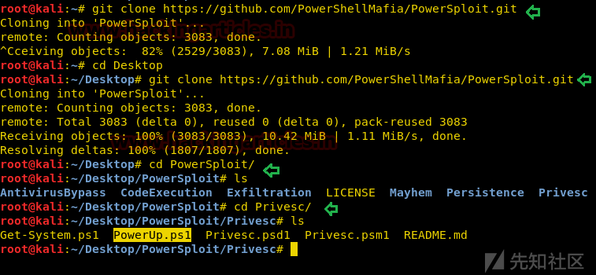

然后加载powershell，导入下载的脚本：

load powershell
powershell_import '/root/Desktop/PowerSploit/Privesc/PowerUp.ps1'
powershell_execute Invoke-AllChecks 

这几条命令能够显示出目标主机存在哪些漏洞和对应的提权exp，如图：
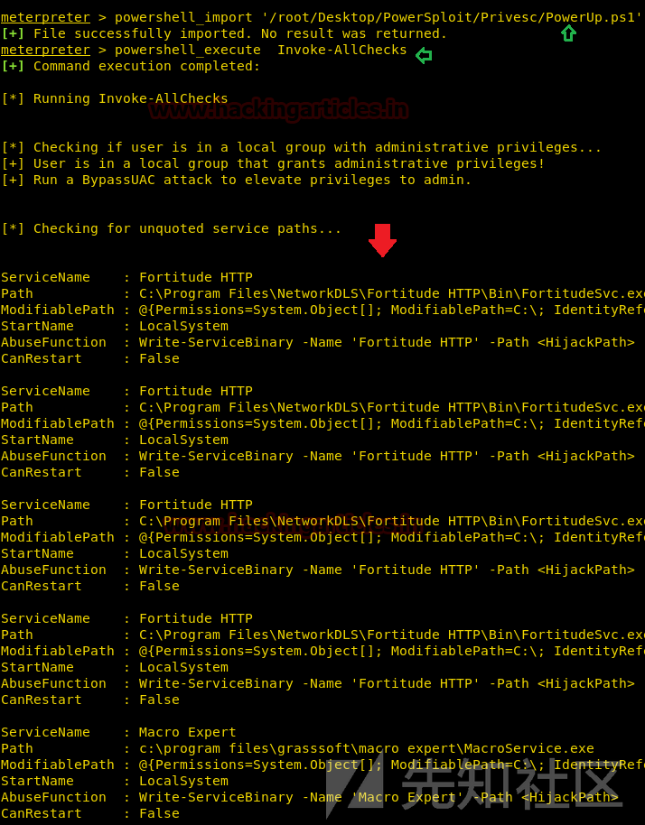

Tags: [脚本](https://paper.tuisec.win/search.jsp?keywords=%E8%84%9A%E6%9C%AC&&search_by_html=tags), [提权](https://paper.tuisec.win/search.jsp?keywords=%E6%8F%90%E6%9D%83&&search_by_html=tags), [文件](https://paper.tuisec.win/search.jsp?keywords=%E6%96%87%E4%BB%B6&&search_by_html=tags), [命令](https://paper.tuisec.win/search.jsp?keywords=%E5%91%BD%E4%BB%A4&&search_by_html=tags), [漏洞](https://paper.tuisec.win/search.jsp?keywords=%E6%BC%8F%E6%B4%9E&&search_by_html=tags), [运行](https://paper.tuisec.win/search.jsp?keywords=%E8%BF%90%E8%A1%8C&&search_by_html=tags), [权限](https://paper.tuisec.win/search.jsp?keywords=%E6%9D%83%E9%99%90&&search_by_html=tags), [服务](https://paper.tuisec.win/search.jsp?keywords=%E6%9C%8D%E5%8A%A1&&search_by_html=tags), [受害](https://paper.tuisec.win/search.jsp?keywords=%E5%8F%97%E5%AE%B3&&search_by_html=tags), [向量](https://paper.tuisec.win/search.jsp?keywords=%E5%90%91%E9%87%8F&&search_by_html=tags),

### 为您推荐了相关的技术文章:

1. [[独家]蓝牙App漏洞系列分析之三CVE-2017-0645|漏洞研究 - 安全技术社区](https://paper.tuisec.win/detail/33bde156e2aafa7)
2. [Redis安全总结](https://paper.tuisec.win/detail/21bb7c79f44458f)
3. [内网渗透思路整理与工具使用](https://paper.tuisec.win/detail/96c17b9e2123225)
4. [JVM安全学习 | 岚光](https://paper.tuisec.win/detail/ab9b3f1890930a5)
5. [php webshell下直接反弹shell（不借助任何其他语言） | 离别歌](https://paper.tuisec.win/detail/1a02c51616e80b4)

**原文链接： [xz.aliyun.com](https://paper.tuisec.win/go/aHR0cHM6Ly94ei5hbGl5dW4uY29tL3QvMjg1Mw==)**